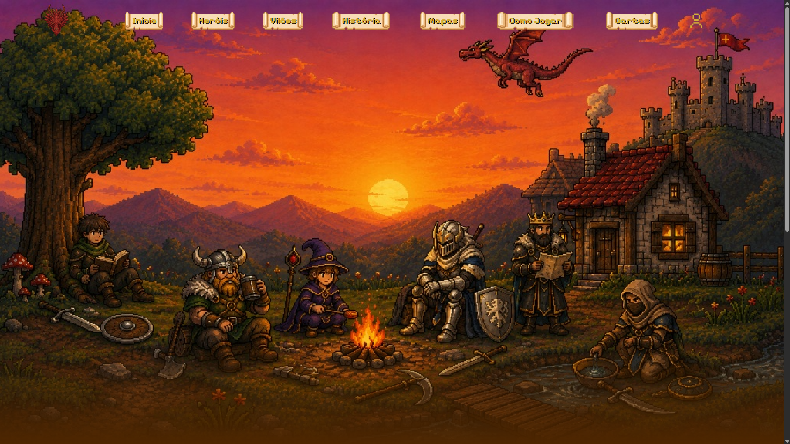
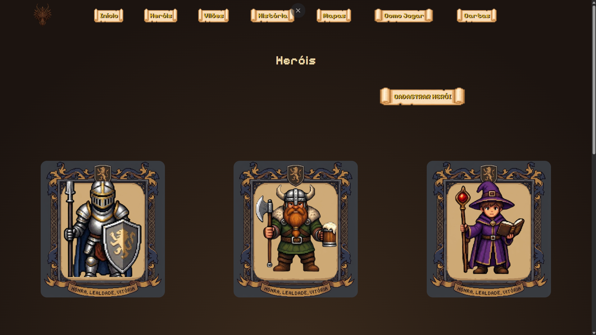
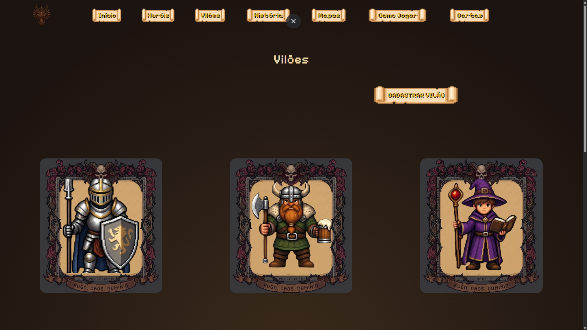
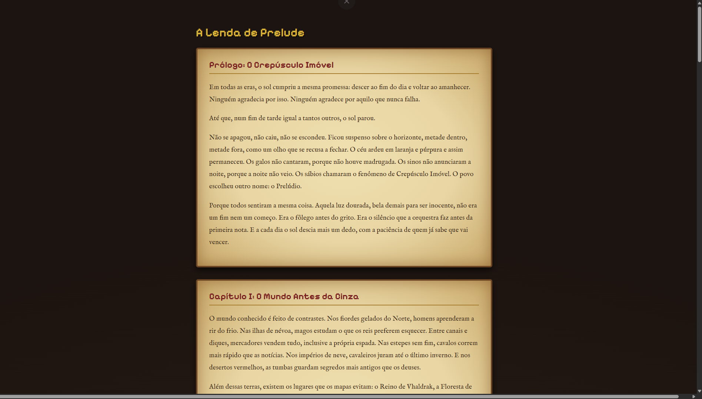
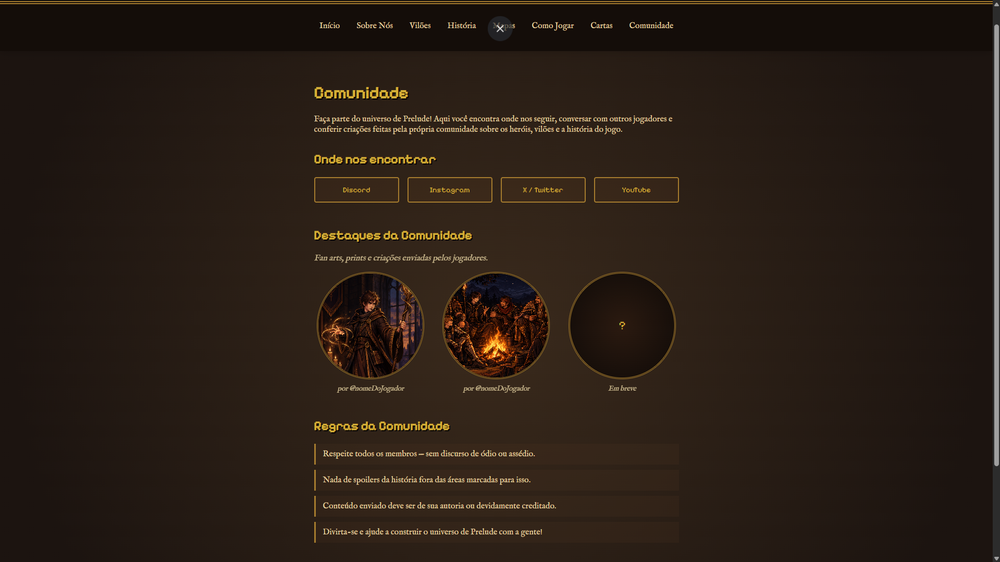

<p align="center">
  
</p>

<h1 align="center">Prelude</h1>

<p align="center">
  Site do jogo <strong>Prelude</strong>, projeto acadêmico desenvolvido em grupo.<br>
  O sol parou no horizonte. Seis desconhecidos, uma fogueira e cinco inimigos.
</p>

---

## Capturas de tela

### Página inicial


### Heróis e Vilões



### História (Lore)


### Comunidade


---

## Páginas

| Página | Arquivo |
|---|---|
| Início | `paginas/PaginaInicial.html` |
| Heróis | `paginas/Herois.html` |
| Vilões | `paginas/Viloes.html` |
| História | `paginas/lore.html` |
| Sobre Nós | `paginas/sobre.html` |
| Comunidade | `paginas/comunidade.html` |
| Cadastro de Heróis | `paginas/CadastroHerois.html` |
| Cadastro de Vilões | `paginas/CadastroViloes.html` |

## Tecnologias

- HTML5
- CSS3
- Google Fonts (Pixelify Sans, IM Fell English)

## Estrutura de pastas

```
Prelude-Site/
├── csselementos/   # estilos de componentes
├── csspaginas/     # estilos de cada página
├── fotos/          # imagens e ícones
│   └── readme/     # prints usados neste README
├── paginas/        # páginas HTML
└── README.md
```

## Como abrir o projeto

1. Clone o repositório:
```
   git clone https://github.com/Renatinho0/Prelude-Site
```
2. Abra a pasta no VS Code.
3. Instale a extensão **Live Server**.
4. Clique com o botão direito em `paginas/PaginaInicial.html` e escolha **Open with Live Server**.

## Equipe

- Renato Gabriel de Oliveira Mandu 1 — RA: 825512031
- Joaquim Melo Moura 2 — RA: 825146970
- Vinicius Moura Hosokawa 3 — RA: 825133364
- João Rafael Martins Florencio 4 — RA: 82516076
- Nicolas Santos 5 — RA: 825155356
- Vinicius Prado de Souza 6 — 825126008

## Informações acadêmicas

- Instituição: _Universidade São Judas Tadeu_
- Curso: Engenharia de Software
- Disciplina: _Usabilidade, desenvolvimento web, mobile e jogos_
- Semestre: _2026/4 Semestre_